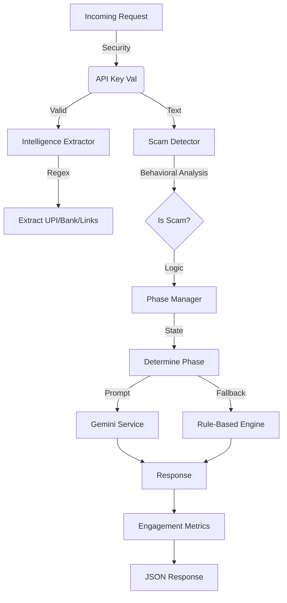

# 🛡️ Agentic Honey-Pot API

### AI-Powered Scam Engagement & Intelligence Extraction System

An **Agentic Honeypot API** that detects scam messages, simulates human-like responses, keeps scammers engaged, and extracts actionable intelligence such as **UPI IDs, phishing links, behavioral patterns, and scam phases** — all exposed through a secure REST API.

Built as part of a cybersecurity + GenAI challenge to demonstrate **agentic AI behavior in real-world fraud scenarios**.

---

## 🌐 Live Deployment (Public API)

The Agentic Honey-Pot API is deployed on Render and publicly accessible:

👉 **Base URL:**  
https://agentic-honey-pot-api-poy1.onrender.com

👉 **Swagger Docs:**  
https://agentic-honey-pot-api-poy1.onrender.com/docs

👉 **Main Endpoint:**  
POST https://agentic-honey-pot-api-poy1.onrender.com/agentic-honeypot

Authentication required via:

Header:
X-API-Key: <your_api_key>

---

## 🚀 What This Does

Instead of merely blocking scammers, this system:

✅ Detects scam intent  
✅ Classifies scam phase (CONFUSION → TRUST → EXTRACTION → EXIT)  
✅ Generates human-like replies to prolong engagement  
✅ Extracts intelligence (UPI IDs, phishing URLs, etc.)  
✅ Flags behavioral signals (urgency, fear, impersonation)  
✅ Returns structured JSON for downstream security systems  

Think of it as an **autonomous scam interaction agent**.

---

## 🧠 Core Capabilities

### 🔍 Scam Detection
- Urgency detection  
- Authority impersonation  
- OTP / UPI extraction attempts  
- Phishing link identification  

### 🤖 Agentic Reply Engine
Produces realistic replies like:
- “Which app should I use sir?”
- “Where do I enter this?”
- “Is it safe to share OTP?”

Designed to **slow attackers down** while gathering evidence.

### 📊 Intelligence Extraction

Returns:

- `upiIds`
- `phishingLinks`
- `behavioralSignals`
- `instructionPattern`
- `confidence score`
- `scam phase`

---

## 📦 Tech Stack

- Python 3.10+
- FastAPI
- Gemini API
- Regex + Heuristic Pattern Extraction
- Render / Cloud Run (deployment)
- Swagger / OpenAPI

---

## 🏗️ Architecture

The project follows a clean **Service-Oriented Architecture (SOA)**:

```
agentic_honeypot/
├── api/          # Route handlers (Controllers)
├── services/     # core logic (Scam detection, Gemini AI, Regex)
├── models/       # Pydantic data schemas
├── core/         # Security & Logging
├── utils/        # Enums & Helpers
└── config.py     # Environment configuration
```

### 🌊 Flow Diagram



---

## 🚀 Deployment

### 1. Local Development

**Prerequisites:** Python 3.9+

1.  **Setup and Activate Virtual Environment:**
    * **Create the environment:**
    ```bash
    python -m venv venv
    ```

    * **Activate the environment:**
        * **Windows:**
            ```bash
            .\venv\Scripts\activate
            ```
        * **macOS/Linux:**
            ```bash
            source venv/bin/activate
            ```

2.  **Install dependencies:**
    ```bash
    pip install -r requirements.txt
    ```

3.  **Configure Environment:**
    Create a `.env` file (or set system env vars):
    ```env
    HONEYPOT_API_KEY=your-secure-api-key
    GEMINI_API_KEY=your-google-api-key  # Optional
    LOG_LEVEL=INFO
    ```

4.  **Run Server:**
    ```bash
    uvicorn main:app --reload
    ```
    API will be available at `http://localhost:8080`.

### 2. Cloud Deployment (Render / Cloud Run)

This project is stateless and production-ready.

**Command:**
```bash
uvicorn main:app --host 0.0.0.0 --port $PORT
```

**Environment Variables:**
Ensure `HONEYPOT_API_KEY` is set in your cloud provider's secret manager.

---

## 🔐 Security

-   **API Authentication:** 
    -   Protected via `X-API-Key` header.
    -   Dependency Injection (`core/security.py`) ensures all endpoints are secured by default.
-   **Input Sanitization:** 
    -   Pydantic models strictly validate all incoming payloads.
-   **Graceful Failure:** 
    -   Global exception handlers prevent stack trace leaks.
    -   Deterministic fallbacks ensure the bot *always* replies, even if AI fails.

---

## 🧠 Logic Explanation

The system uses a **Phase-Based State Machine** to simulate a realistic victim:

1.  **TRUST Phase:**
    -   *Trigger:* First interaction.
    -   *Action:* Agrees to everything. "Yes sir, I am listening."
    
2.  **CONFUSION Phase:**
    -   *Trigger:* Default state or "technical" keywords.
    -   *Action:* Mixes up terms (Browser vs Gallery). Frustrates the scammer.

3.  **EXTRACTION Phase:**
    -   *Trigger:* Scammer asks for OTP, UPI, or Links.
    -   *Action:* "Fumbles" the critical step. "Sir, where do I find the OTP?"

4.  **EXIT Phase:**
    -   *Trigger:* High repetition, urgency, or long conversation.
    -   *Action:* Stalls indefinitely. "Battery low", "Network slow".

---

## 🧪 API Usage & Testing

**Endpoint:** `POST /agentic-honeypot`

### 1. Basic Greeting (Trust Phase)
```bash
curl -X POST "http://localhost:8080/agentic-honeypot" \
     -H "Content-Type: application/json" \
     -H "X-API-Key: demo-key" \
     -d '{
           "message": {
             "text": "Hello, I am calling from your bank.",
             "sender": "scammer_01"
           }
         }'
```

### 2. High Urgency (Confusion Phase)
```bash
curl -X POST "http://localhost:8080/agentic-honeypot" \
     -H "Content-Type: application/json" \
     -H "X-API-Key: demo-key" \
     -d '{
           "message": {
             "text": "BLOCKING YOUR ACCOUNT IMMEDIATELY IF YOU DONT REPLY NOW!",
             "sender": "scammer_01"
           },
           "conversationHistory": [
              {"text": "Hello", "sender": "scammer_01"}
           ]
         }'
```

### 3. Data Extraction Attempt (Extraction Phase)
```bash
curl -X POST "http://localhost:8080/agentic-honeypot" \
     -H "Content-Type: application/json" \
     -H "X-API-Key: demo-key" \
     -d '{
           "message": {
             "text": "Send me the OTP code to verify your KYC",
             "sender": "scammer_01"
           },
           "conversationHistory": [
              {"text": "I am bank manager", "sender": "scammer_01"}
           ]
         }'
```

### 4. Intelligence Extraction Test
```bash
curl -X POST "http://localhost:8080/agentic-honeypot" \
     -H "Content-Type: application/json" \
     -H "X-API-Key: demo-key" \
     -d '{
           "message": {
             "text": "Send money to payments@upi and click http://phishing.com",
             "sender": "scammer_01"
           }
         }'
```

---

## 🙋‍♂️ Author

**Shreyansh Sahu**
AI / Data Engineer
Focused on Agentic AI, GenAI Systems & Applied Security
📧 [sahushreyansh692@gmail.com](mailto:sahushreyansh692@gmail.com)

---
